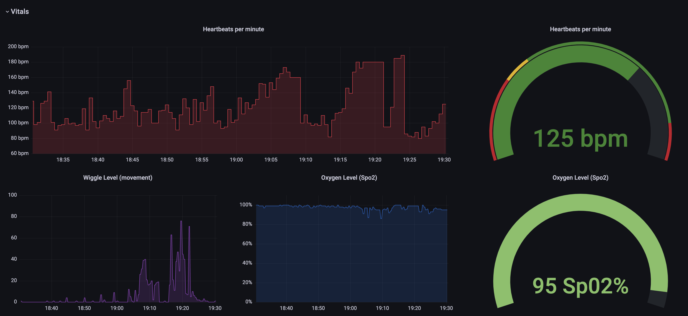

# Owlet Monitor

Fetches Owlet Smart Sock data from their API and exports it as Prometheus metrics.  More exporter formats can
be added easily.  *This project was originally forked from [mbevand/owlet_monitor](https://github.com/mbevand/owlet_monitor).*



## API versions

Should support Sock v2, but is only tested with Sock v3 as this is the device I have.  The code has been setup to
handle either path, so if a v2 option is not working please submit a PR to adapt.

## Usage

### Python

`OWLET_USER=asdf@asdf.com OWLET_PASS=asdf python -m owlet_monitor`

### Docker

`docker run -e OWLET_USER=asdf@asdf.com -e OWLET_PASS=asdf -p 9090:9090 linjmeyer/owlet-monitor`

### Europe Region

Set environment variable `OWLET_REGION=europe` if you are in Europe/EU.

# Docs

## Prometheus Metrics

See [docs/PROM.md](docs/PROM.md)

## Grafana dashboard

See [docs/grafana_dashboard.json](docs/grafana_dashboard.json) for an example Grafana dashboard using Prometheus.
This is optional but can serve as a good kick-off for your own dashboard.  (This is the dashboard in the image above)

## API response examples

```
REAL_TIME_VITALS
{'type': 'Property', 'base_type': 'string', 'read_only': True, 'direction': 'output', 'scope': 'user', 'data_updated_at': '2021-11-07T01:35:05Z', 'key': 0000, 'device_key': 0000, 'product_name': '0000', 'track_only_changes': False, 'display_name': 'Real-Time Vitals', 'host_sw_version': False, 'time_series': False, 'derived': False, 'app_type': None, 'recipe': None, 'value': '{"ox":99,"hr":134,"mv":0,"sc":2,"st":33,"bso":1,"bat":95,"btt":925,"chg":0,"aps":0,"alrt":0,"ota":0,"srf":0,"rsi":55,"sb":0}', 'denied_roles': [], 'ack_enabled': False, 'retention_days': 30, 'ack_status': None, 'ack_message': None, 'acked_at': None}
```
